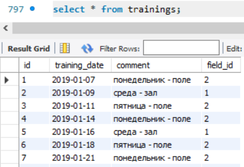
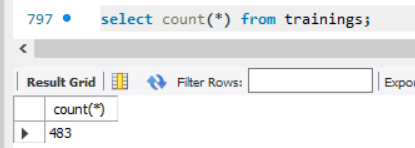
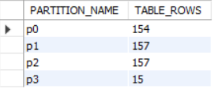

Используем таблицу trainings - история тренировок.

В таблице 483 записи.

Партиционирование таблицы по годам

    ALTER TABLE trainings PARTITION BY RANGE (year(training_date)) (
        PARTITION p0 VALUES LESS THAN (2020),
        PARTITION p1 VALUES LESS THAN (2021),
        PARTITION p2 VALUES LESS THAN (2022),
        PARTITION p3 VALUES LESS THAN MAXVALUE
    );

Результат выполнения запроса

    SELECT p.PARTITION_NAME, p.TABLE_ROWS FROM INFORMATION_SCHEMA.PARTITIONS p WHERE TABLE_NAME = 'trainings';

