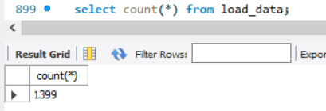
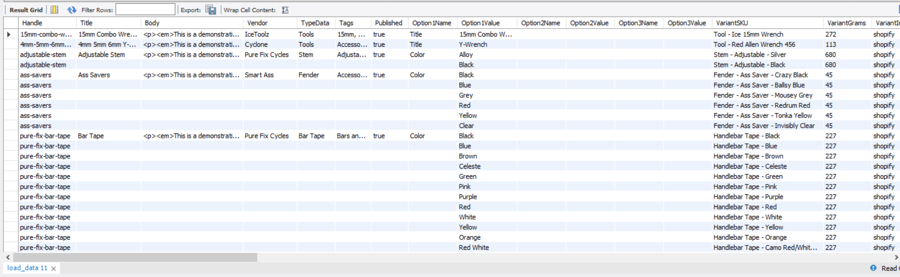

**Создаем процедуру addTraining**

    DELIMITER $$
    CREATE PROCEDURE addTraining ( trainingDate date, fieldId int)
    BEGIN
        DECLARE trainingId int;
        DECLARE finished INTEGER DEFAULT 0;
        DECLARE playerId int DEFAULT 0;
        DECLARE trainerId int DEFAULT 0;
        DEClARE curPlayer 
		    CURSOR FOR 
                SELECT id FROM temp_pl_on_trainings; -- временная таблица с id игроков, создается заранее
        DEClARE curTrainer 
            CURSOR FOR 
                SELECT id FROM temp_tr_on_trainings; -- временная таблица с id тренеров, создается заранее

        -- declare NOT FOUND handler
        DECLARE CONTINUE HANDLER 
            FOR NOT FOUND SET finished = 1;

        START TRANSACTION;
            INSERT INTO trainings (training_date, comment, field_id)
                VALUES (trainingDate, '', fieldId);
			
            SET @trainingId = LAST_INSERT_ID();

            -- заполняем таблицу players_on_trainings (статистика посещения игроками тренировок)
            OPEN curPlayer;
            getPlayer: LOOP
                FETCH curPlayer INTO playerId;
                IF finished = 1 THEN 
                    LEAVE getPlayer;
                END IF;
                INSERT INTO players_on_trainings (training_id, player_id)
                    VALUES (@trainingId, playerId);
            END LOOP getPlayer;
            CLOSE curPlayer;
		
            SET finished = 0;

            -- заполняем таблицу trainers_on_trainings (тренера на тренировках)
            OPEN curTrainer;
            getTrainer: LOOP
                FETCH curTrainer INTO trainerId;
                IF finished = 1 THEN 
                    LEAVE getTrainer;
                END IF;
                INSERT INTO trainers_on_trainings (training_id, trainer_id)
                    VALUES (@trainingId, trainerId);
            END LOOP getTrainer;
            CLOSE curTrainer; 
        COMMIT;
    END$$
    DELIMITER ;
    -- вызываем процедуру
    call addTraining('2022-02-09', 1);
    

**Создаем таблицу load_data для загрузки данных из файла. Загружаем данные**

    LOAD DATA INFILE 'C:\\ProgramData\\MySQL\\MySQL Server 8.0\\Uploads\\Bicycles.csv' 
        INTO TABLE load_data
        FIELDS TERMINATED BY ',' ENCLOSED BY '"'
        LINES TERMINATED BY '\n'
        IGNORE 1 LINES;

Посмотрим число записей в таблице

И сами записи в таблице

       
