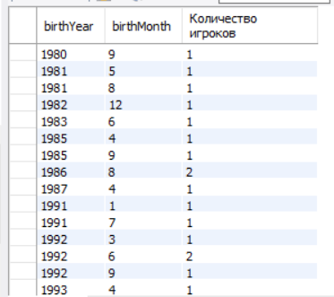

Посчитаем количество игроков по месяцу и году рождения
    
    
    select 
        year(p.date_of_birth) birthYear,
        month(p.date_of_birth) birthMonth,
        count(p.id) as 'Количество игроков'
    from players_new  p
    group by year(p.date_of_birth), month(p.date_of_birth)
    order by birthYear, birthMonth;

Добавим rollup

    select 
        year(p.date_of_birth) birthYear,
        month(p.date_of_birth) birthMonth,
        count(p.id) as 'Количество игроков'
    from players_new  p
    group by year(p.date_of_birth), month(p.date_of_birth) with rollup
    order by birthYear, birthMonth;
    

Добавим having, выберем игроков моложе 1999 года рождения

    select 
        year(p.date_of_birth) birthYear,
        month(p.date_of_birth) birthMonth,
        count(p.id) as 'Количество игроков'
    from players_new  p
    group by year(p.date_of_birth), month(p.date_of_birth)
    having birthYear > 1999;

Добавим grouping

    select 
        if(grouping(year(p.date_of_birth)), 'All years', year(p.date_of_birth)) AS birthYear,
        if(grouping(month(p.date_of_birth)), 'All months', month(p.date_of_birth)) AS birthMonth,
        count(p.id) as 'Количество игроков'
    from players_new p
    group by year(p.date_of_birth), month(p.date_of_birth) with rollup
    order by birthYear desc, birthMonth desc;

Найдем максимальный рост игроков на каждой позиции

    select 
        p.role_id roleId,
        max(p.height) as playerHeight,
        r.name as 'Позиция'
    from players_new  p
    join roles r on p.role_id = r.id
    group by p.role_id, r.name;

Найдем минимальный вес игроков на каждой позиции

    select 
        p.role_id roleId,
        min(p.weight) as playerWeight,
        r.name as 'Позиция'
    from players_new  p
    join roles r on p.role_id = r.id
    group by p.role_id, r.name;

В таблице mathes приведена статистика по проведенным матчам. 

Посчитаем количество проигранных матчей с каждой командой в таблице и общее число очков с каждой стороны за все время.

    select 
        m.rival_name as rivalName,
        count(
        CASE 
                WHEN m.rival_score > m.score THEN  m.id 
            END) as lostMatches,
        sum(m.rival_score) as 'Общее число очков соперника',
        sum(m.score) as 'Число очков команды'
    from matches_new m
    group by rivalName
    order by lostMatches desc;

    
    
    
