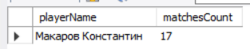
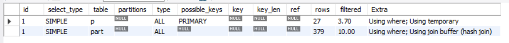
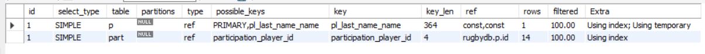

Добавляем индекс для таблицы participation (участие игрока в матче)

    create index participation_player_id on participation(player_id);

Создаем полнотекстовый индекс для таблицы players

    create index pl_last_name_name on players (last_name, name, second_name);
    
Посчитаем количество сыгранных игроком мачтей за все время

    explain
    select concat_ws(' ' ,p.last_name, p.name) playerName,
        count(part.id) matchesCount
    from players p
    join participation part on part.player_id = p.id
    where p.last_name = 'Макаров' and p.name = 'Константин'
    group by playerName;

без индексов

c индексами

