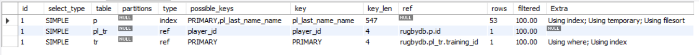

Запрос

Посчитаем статистику по посещению тренировок игроками в июле 2021 года

    select count(*) countTr, concat_ws(' ', p.name, p.last_name) playerName 
    from players p
    join players_on_trainings pl_tr on pl_tr.player_id = p.id
    join trainings tr on pl_tr.training_id = tr.id
    where year(tr.training_date) = 2021 and month(tr.training_date) = 7
    group by playerName
    order by playerName;

    desc select count(*) countTr, concat_ws(' ', p.name, p.last_name) playerName 
    from players p
    join players_on_trainings pl_tr on pl_tr.player_id = p.id
    join trainings tr on pl_tr.training_id = tr.id
    where year(tr.training_date) = 2021 and month(tr.training_date) = 7
    group by playerName
    order by playerName;
    

**JSON**

    desc format=json select count(*) countTr, concat_ws(' ', p.name, p.last_name) playerName 
    from players p
    join players_on_trainings pl_tr on pl_tr.player_id = p.id
    join trainings tr on pl_tr.training_id = tr.id
    where year(tr.training_date) = 2021 and month(tr.training_date) = 7
    group by playerName
    order by playerName;

    {
      "query_block": {
        "select_id": 1,
        "cost_info": {
          "query_cost": "95.65"
        },
        "ordering_operation": {
          "using_filesort": false,
          "grouping_operation": {
            "using_temporary_table": true,
            "using_filesort": true,
            "cost_info": {
              "sort_cost": "53.00"
            },
            "nested_loop": [
              {
                "table": {
                  "table_name": "p",
                  "access_type": "index",
                  "possible_keys": [
                    "PRIMARY",
                    "pl_last_name_name"
                  ],
                  "key": "pl_last_name_name",
                  "used_key_parts": [
                    "last_name",
                    "name",
                    "second_name"
                  ],
                  "key_length": "547",
                  "rows_examined_per_scan": 53,
                  "rows_produced_per_join": 53,
                  "filtered": "100.00",
                  "using_index": true,
                  "cost_info": {
                    "read_cost": "0.25",
                    "eval_cost": "5.30",
                    "prefix_cost": "5.55",
                    "data_read_per_join": "43K"
                  },
                  "used_columns": [
                    "id",
                    "name",
                    "last_name"
                  ]
                }
              },
              {
                "table": {
                  "table_name": "pl_tr",
                  "access_type": "ref",
                  "possible_keys": [
                    "player_id"
                  ],
                  "key": "player_id",
                  "used_key_parts": [
                    "player_id"
                  ],
                  "key_length": "4",
                  "ref": [
                    "rugbydb.p.id"
                  ],
                  "rows_examined_per_scan": 1,
                  "rows_produced_per_join": 53,
                  "filtered": "100.00",
                  "cost_info": {
                    "read_cost": "13.25",
                    "eval_cost": "5.30",
                    "prefix_cost": "24.10",
                    "data_read_per_join": "848"
                  },
                  "used_columns": [
                    "id",
                    "training_id",
                    "player_id"
                  ]
                }
              },
              {
                "table": {
                  "table_name": "tr",
                  "access_type": "ref",
                  "possible_keys": [
                    "PRIMARY"
                  ],
                  "key": "PRIMARY",
                  "used_key_parts": [
                    "id"
                  ],
                  "key_length": "4",
                  "ref": [
                    "rugbydb.pl_tr.training_id"
                  ],
                  "rows_examined_per_scan": 1,
                  "rows_produced_per_join": 53,
                  "filtered": "100.00",
                  "using_index": true,
                  "cost_info": {
                    "read_cost": "13.25",
                    "eval_cost": "5.30",
                    "prefix_cost": "42.65",
                    "data_read_per_join": "21K"
                  },
                  "used_columns": [
                    "id",
                    "training_date"
                  ],
                  "attached_condition": "((year(`rugbydb`.`tr`.`training_date`) = 2021) and (month(`rugbydb`.`tr`.`training_date`) = 7))"
                }
              }
            ]
          }
        }
      }
    }
    
**TREE**
    
    desc format=tree select count(*) countTr, concat_ws(' ', p.name, p.last_name) playerName 
    from players p
    join players_on_trainings pl_tr on pl_tr.player_id = p.id
    join trainings tr on pl_tr.training_id = tr.id
    where year(tr.training_date) = 2021 and month(tr.training_date) = 7
    group by playerName
    order by playerName;
    
    -> Sort: playerName
        -> Table scan on <temporary>
            -> Aggregate using temporary table
                -> Nested loop inner join  (cost=42.65 rows=53)
                    -> Nested loop inner join  (cost=24.10 rows=53)
                        -> Index scan on p using pl_last_name_name  (cost=5.55 rows=53)
                        -> Index lookup on pl_tr using player_id (player_id=p.id)  (cost=0.25 rows=1)
                    -> Filter: ((year(tr.training_date) = 2021) and (month(tr.training_date) = 7))  (cost=0.25 rows=1)
                        -> Index lookup on tr using PRIMARY (id=pl_tr.training_id)  (cost=0.25 rows=1)

   
