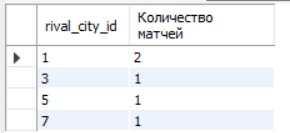

Создаем роли

    CREATE ROLE IF NOT EXISTS clientUser;
    CREATE ROLE IF NOT EXISTS manager;

Создадим процедуру get_statistic - количество проигранных матчей с каждой командой в таблице и общее число очков с каждой стороны за определенный год (matchYear) и в определенных соревнованиях (matchTournament).

    DELIMITER $$
    USE `otus`$$
    CREATE PROCEDURE get_statistic (IN matchYear char(4), IN matchTournament int)
    BEGIN
        SELECT 
            m.rival_name AS rivalName,
            COUNT(
            CASE 
                    WHEN m.rival_score > m.score THEN  m.id 
                END) as lostMatches,
            SUM(m.rival_score) as 'Общее число очков соперника',
            SUM(m.score) as 'Число очков команды'
        FROM matches_new m
        WHERE YEAR(m.match_date) = matchYear and m.tournament_id = matchTournament
        GROUP BY rivalName
        ORDER BY lostMatches DESC;
    END$$
    DELIMITER ;
    
    
    call get_statistic('2020', 16);
    

Добавим сортировку по входящему параметру и постраничную навигацию.

    delimiter $$
    use `otus`$$
    create procedure get_statistic_new (
        in matchYear char(4),
        in matchTournament int,
        in orderBy char(20),
        in orderSort char(4), 
        in pagerOffer int,
        in pagerLimit int
    )
    begin
        set @query = CONCAT('
            select 
            m.rival_name as rivalName,
            count(
            case 
                    when m.rival_score > m.score then  m.id 
                end) as lostMatches,
            sum(m.rival_score) as rivalScore,
            sum(m.score) as score
            from matches_new m
            where year(m.match_date) = ',matchYear,' and m.tournament_id = ',matchTournament,'
            group by rivalName
            order by ',orderBy,' ',orderSort,'
            limit ',pagerLimit,', ',pagerOffer,';'
        );
        prepare SQL_QUERY from @query;
        execute SQL_QUERY;
    end$$
    delimiter ;
    
    call get_statistic_new('2020', 16, 'score', 'desc', 3 , 1);

Даем права на запуск процедуры пользователю  clientUser

    GRANT EXECUTE ON PROCEDURE get_statistic_new  TO clientUser;

Посчитаем количество сыгранных матчей за разные периоды и с различными уровнями группировки.

    DELIMITER $$
    USE `otus`$$
    CREATE PROCEDURE get_statistic_manager (IN dateStart date, IN dateEnd date, IN groupBy char(20))
    BEGIN
        SET @query = CONCAT('
            SELECT
                m.',groupBy,' AS ',groupBy,',
                COUNT(m.id) AS "Количество матчей"
            FROM matches_new m
            WHERE m.match_date > "',dateStart,'" and m.match_date < "',dateEnd,'"
            GROUP BY m.',groupBy,';
        ');
    PREPARE SQL_QUERY from @query;
    EXECUTE SQL_QUERY;
    END$$
    DELIMITER ;
    
Количество матчей за период с группировкой по турнирам.

    call get_statistic_manager('2019-01-01', '2020-01-01', 'tournament_id');

Количество матчей за период с группировкой по городу команды соперника.

    call get_statistic_manager('2020-01-01', '2021-01-01', 'rival_city_id');

Даем права на запуск процедуры пользователю manager

    GRANT EXECUTE ON PROCEDURE get_statistic_manager  TO manager;

