Создаем бэкап базы world

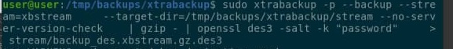
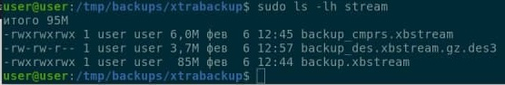

Создаем тестовую базу world_test

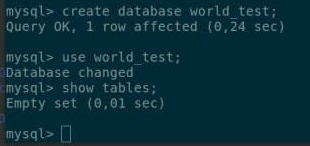

Подготавливаем бэкап, расшифровываем  и извлекаем из архива обратно

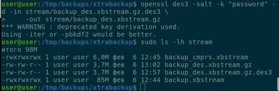

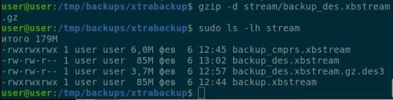

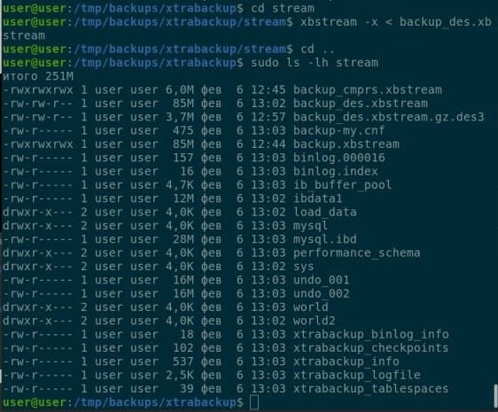

Восстанавливаем структуру базы из дампа

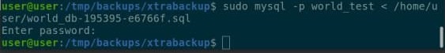

Проверям восстановление базы world_test

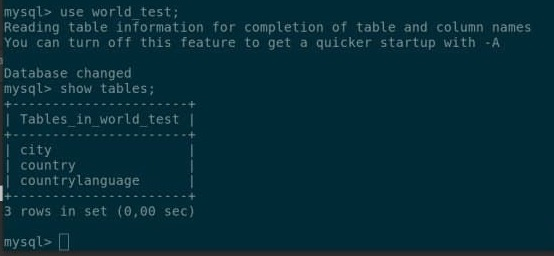

Смотрим таблицу city и открепляем tablespace

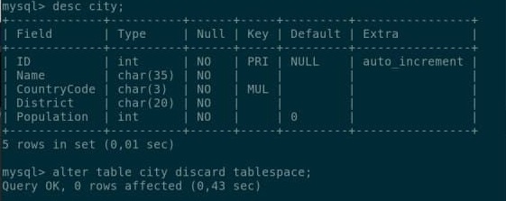

Восстанавливаем таблицу city

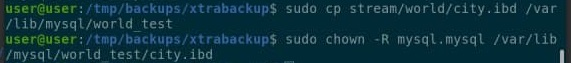

Добавляем tablespacе

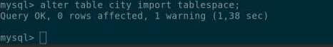

Делаем выборку из таблицы city

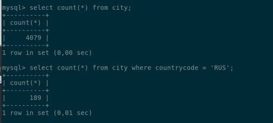

Ответ **189**

