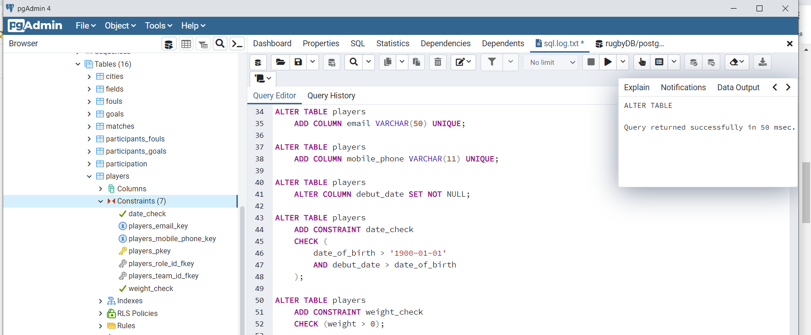

БД с ограничениями + новые поля

Таблица players (Список игроков)
Кардинальность полей
• email – высокая
• mobile_phone – высокая
• gender – низкая
Constraints
• weight_check
Ограничение поле вес больше 0
• date_check
Дата рождения date_of_birth больше “1990-01-01”
и дата debut_date (первый выход в игре за команду) больше даты рождения
• Уникальный email
• Уникальный mobile_phone

Таблица players_on_trainings (Таблица связей: посещение игроками тренировок)
Кардинальность полей
• training_id – средняя
• player_id – средняя
Constraints
• unique_training
Ограничение на дубли посещений, необходимо уникальное сочетание пары: ID игрока, ID тренировки, чтобы один игрок посетил одну тренировку один раз.

Таблица trainers_on_trainings (Таблица связей: посещение тренерами тренировок)

Кардинальность полей
• training_id – средняя
• trainer_id – средняя

Constraints
• unique_trainer_training
Ограничение на дубли посещений, необходимо уникальное сочетание пары: ID тренера, ID тренировки, чтобы один тренер посетил одну тренировку один раз.

Таблица participation (Таблица связей: участие игрока в матче)

Кардинальность полей
• match_id – средняя
• player_id – средняя

Constraints
• unique_participation
Ограничение на дубли участия в матчах, необходимо уникальное сочетание пары: ID игрока, ID матча, чтобы один уникальный игрок участвовал в одном уникальном матче одни раз.

Index
• name_last_name_index
Индекс для поиска по Фамилии и Имени игрока в таблице players
• participation_index
Индекс для поиска участия игрока в матче в таблице participation
• players_on_trainings_index
Индекс для поиска посещения игроком тренировки в таблице players_on_trainings
• trainers_on_trainings_index
Индекс для поиска посещения тренером тренировки в таблице trainers_on_trainings

Возможные запросы
Количество проведенных игроком матчей.
Количество тренировок, которые посетил игрок за период времени: неделя/месяц/сезон.
Количество очков, которые набрал игрок за все время/сезон.
