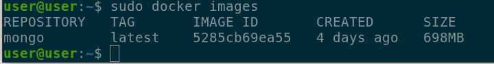
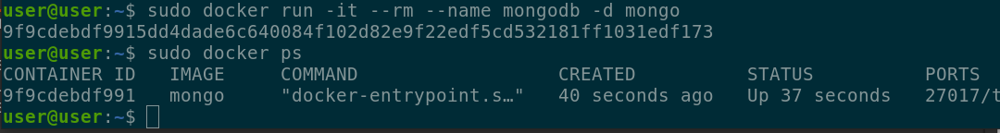
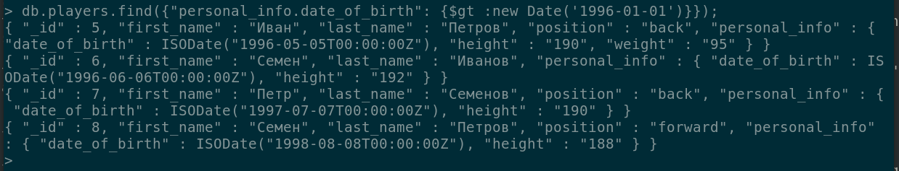
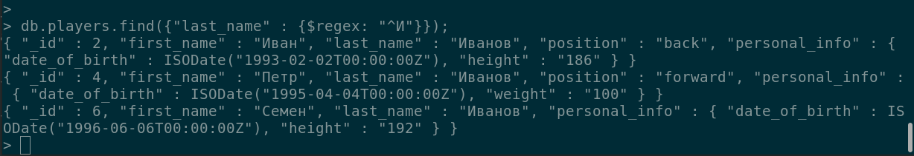
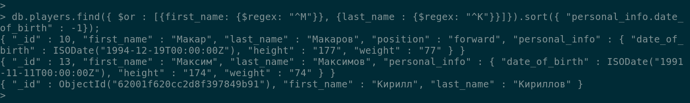
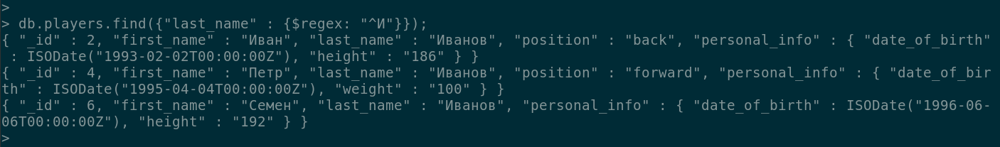
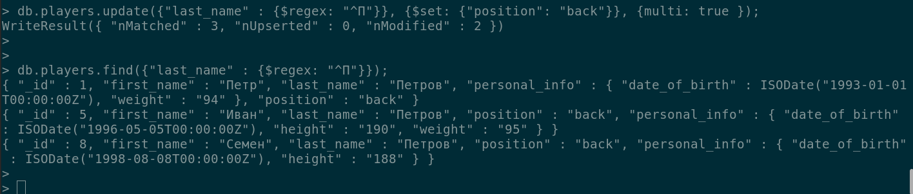

Устанавливаем MongoDB в докере, запускаем

создаем БД otus_new
создаем коллекцию players

    use otus
    db.createCollection("players");
    
    -- Добавляем данные в коллекцию (пример)
    db.players.insert([
        {"_id":1,"first_name":"Петр", "last_name":"Петров", "personal_info":{"date_of_birth":new Date("1993-01-01"),"weight":"94"}},
        {"_id":2,"first_name":"Иван", "last_name":"Иванов", "position":"back", "personal_info":{"date_of_birth": new Date("1993-02-02"),  "height":"186"}}
    ]);

Выберем игроков с датой рождения больше 01-01-1996

    db.players.find({"personal_info.date_of_birth ": {$gt :new Date('1996-01-01')}});

Выберем игроков, у которых last_name начинается с буквы "И"

    db.players.find({"last_name" : {$regex: "^И"}});

Выберем игроков, у которых либо last_name начинается с буквы "П", либо first_name начинается с буквы "С"

    db.players.find({ $or : [{first_name: {$regex: "^С"}}, {last_name : {$regex: "^П"}}]});

Добавим сортировку по дате рождения, по убыванию. Условие: либо last_name начинается с буквы "К", либо first_name начинается с буквы "М"

    db.players.find({ $or : [{first_name: {$regex: "^М"}}, {last_name : {$regex: "^К"}}]}).sort({ "personal_info.date_of_birth" : -1});

Выберем игроков, у которых last_name начинается с буквы "П"

    db.players.find({"last_name" : {$regex: "^П"}});

Обновим пользователей, у которых last_name начинается с буквы "П", свойство position установим = back

    db.players.update({"last_name" : {$regex: "^П"}}, {$set: {"position": "back"}}, {multi: true });

Проверим обновление данных 

