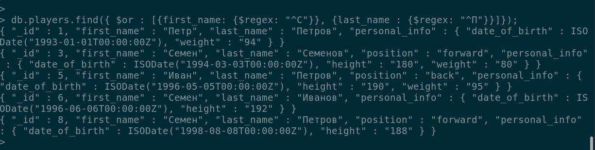

Устанавливаем MongoDB в докере, запускаем

создаем БД otus_new
создаем коллекцию players

    use otus
    db.createCollection("players");
    
    -- Добавляем данные в коллекцию (пример)
    db.players.insert([
        {"_id":1,"first_name":"Петр", "last_name":"Петров", "personal_info":{"date_of_birth":new Date("1993-01-01"),"weight":"94"}},
        {"_id":2,"first_name":"Иван", "last_name":"Иванов", "position":"back", "personal_info":{"date_of_birth": new Date("1993-02-02"),  "height":"186"}}
    ]);

Выберем игроков с датой рождения больше 01-01-1996

    db.players.find({"personal_info.date_of_birth ": {$gt :new Date('1996-01-01')}});

Выберем игроков, у которых last_name начинается с буквы "И"

    db.players.find({"last_name" : {$regex: "^И"}});

Выберем игроков, у которых либо last_name начинается с буквы "П", либо first_name начинается с буквы "С"

    db.players.find({ $or : [{first_name: {$regex: "^С"}}, {last_name : {$regex: "^П"}}]});

Добавим сортировку по дате рождения, по убыванию. Условие: либо last_name начинается с буквы "К", либо first_name начинается с буквы "М"

    db.players.find({ $or : [{first_name: {$regex: "^М"}}, {last_name : {$regex: "^К"}}]}).sort({ "personal_info.date_of_birth" : -1});

Выберем игроков, у которых last_name начинается с буквы "П"

    db.players.find({"last_name" : {$regex: "^П"}});

Обновим пользователей, у которых last_name начинается с буквы "П", свойство position установим = back

    db.players.update({"last_name" : {$regex: "^П"}}, {$set: {"position": "back"}}, {multi: true });

Проверим обновление данных 

Для использования индексов создаем тестовую коллекцию test_users. Заполняем данными
Создаем текстовый индекс на поле last_name

    db.test_users.createIndex({"last_name": "text"}, {"name" : "last name index"});

Выборака без индекса

    > db.test_users.find({"last_name": "Kent"}).explain("executionStats");
    {
        "explainVersion" : "1",
        "queryPlanner" : {
            "namespace" : "otus_new.test_users",
            "indexFilterSet" : false,
            "parsedQuery" : {
                "last_name" : {
                    "$eq" : "Kent"
                }
            },
            "maxIndexedOrSolutionsReached" : false,
            "maxIndexedAndSolutionsReached" : false,
            "maxScansToExplodeReached" : false,
            "winningPlan" : {
                "stage" : "COLLSCAN",
                "filter" : {
                    "last_name" : {
                        "$eq" : "Kent"
                    }
                },
                "direction" : "forward"
            },
            "rejectedPlans" : [ ]
        },
        "executionStats" : {
            "executionSuccess" : true,
            "nReturned" : 2,
            "executionTimeMillis" : 9,
            "totalKeysExamined" : 0,
            "totalDocsExamined" : 2976,
            "executionStages" : {
                "stage" : "COLLSCAN",
                "filter" : {
                    "last_name" : {
                        "$eq" : "Kent"
                    }
                },
                "nReturned" : 2,
                "executionTimeMillisEstimate" : 0,
                "works" : 2978,
                "advanced" : 2,
                "needTime" : 2975,
                "needYield" : 0,
                "saveState" : 2,
                "restoreState" : 2,
                "isEOF" : 1,
                "direction" : "forward",
                "docsExamined" : 2976
            }
        },
        "command" : {
            "find" : "test_users",
            "filter" : {
                "last_name" : "Kent"
            },
            "$db" : "otus_new"
        },
        "serverInfo" : {
            "host" : "14cbaa7bd977",
            "port" : 27017,
            "version" : "5.0.6",
            "gitVersion" : "212a8dbb47f07427dae194a9c75baec1d81d9259"
        },
        "serverParameters" : {
            "internalQueryFacetBufferSizeBytes" : 104857600,
            "internalQueryFacetMaxOutputDocSizeBytes" : 104857600,
            "internalLookupStageIntermediateDocumentMaxSizeBytes" : 104857600,
            "internalDocumentSourceGroupMaxMemoryBytes" : 104857600,
            "internalQueryMaxBlockingSortMemoryUsageBytes" : 104857600,
            "internalQueryProhibitBlockingMergeOnMongoS" : 0,
            "internalQueryMaxAddToSetBytes" : 104857600,
            "internalDocumentSourceSetWindowFieldsMaxMemoryBytes" : 104857600
        },
        "ok" : 1
    }
    > 
