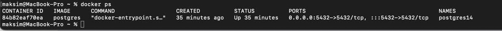
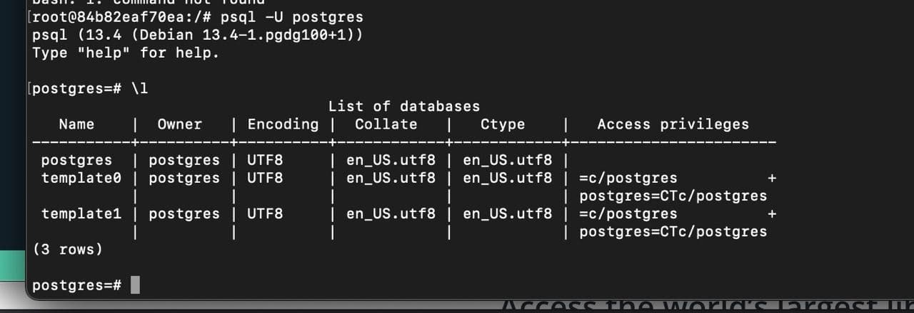
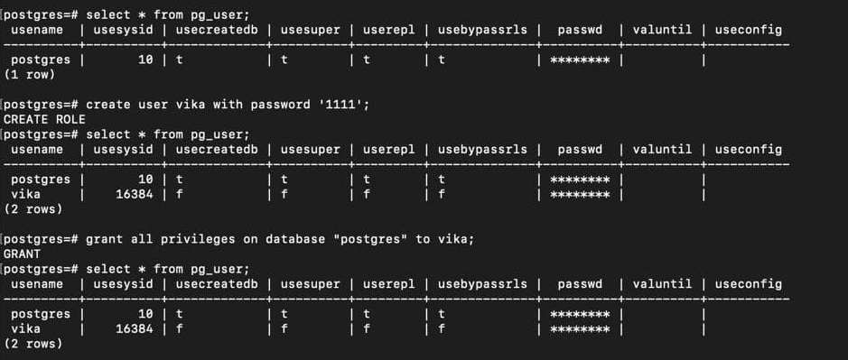
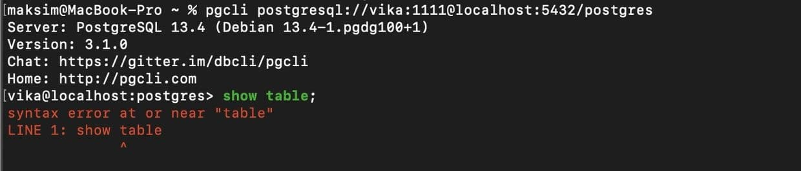
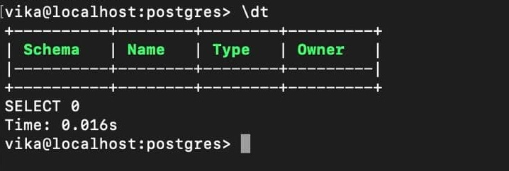
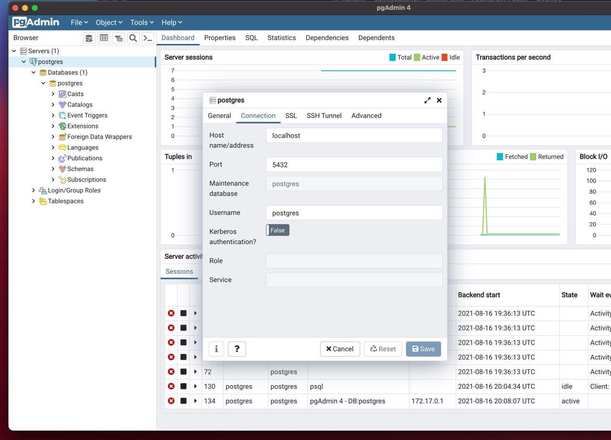

> Развернуть контейнер с PostgreSQL или установить СУБД на виртуальную машину.
> Запустить сервер.

> Создать клиента с подключением к базе данных postgres через командную строку.

Создаем пользователя

Подключаемся через пользователя к БД

> Подключиться к серверу используя pgAdmin или другое аналогичное приложение.

