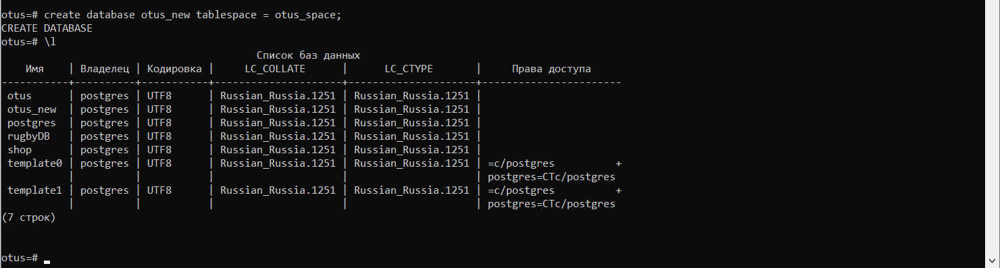

1.	Создаем табличное пространство otus_space

Проверяем

2.  Создаем базу данных otus_new в табличном пространстве otus_space

3.  Смотрим текущие роли бд otus_new

Создаем роль user_adim с правами создания ролей

Изменяем роль user_admin, меняем параметр login для авторизации

Создаем роль db_admin с правами создания БД

4.  Создаем схемы

5.  Добавляем таблицы в схему team

6.  Добавляем таблицы в схему matches

7.  Добавляем таблицы в схему fields

8.  Добавляем таблицы в схему trainings

