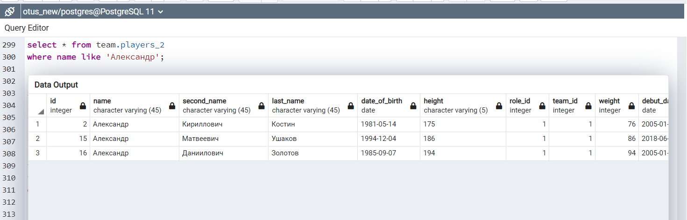
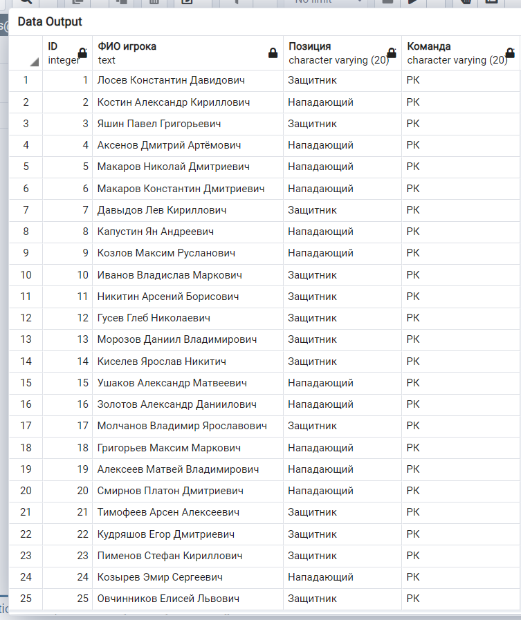
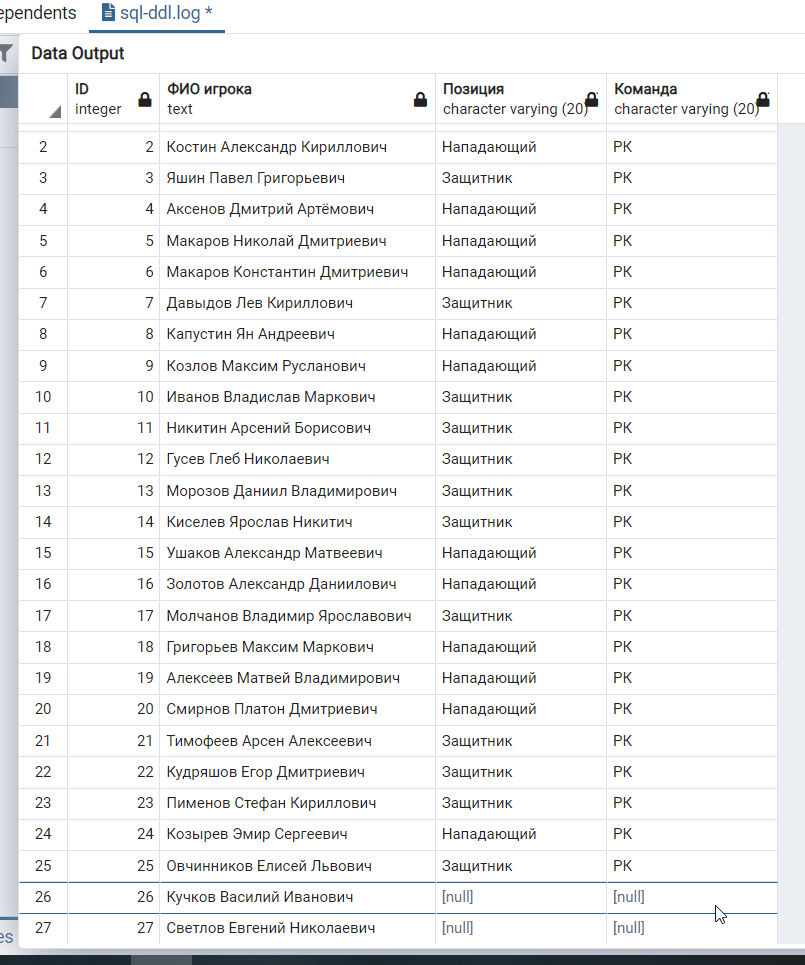
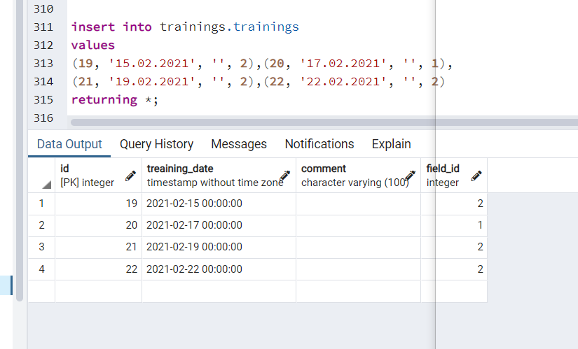
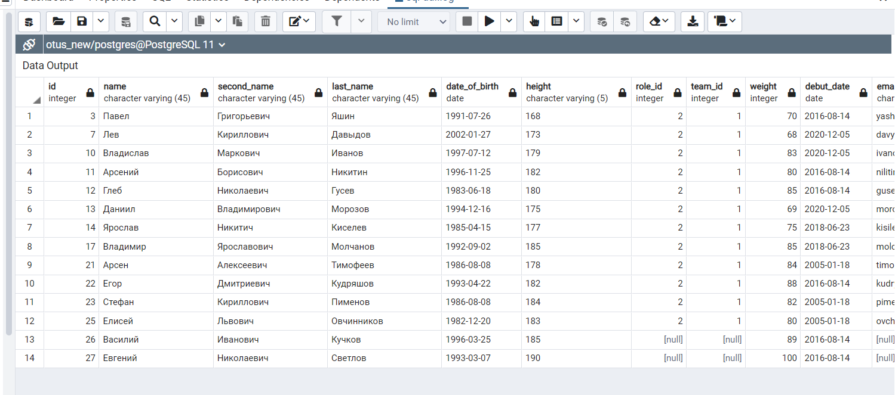
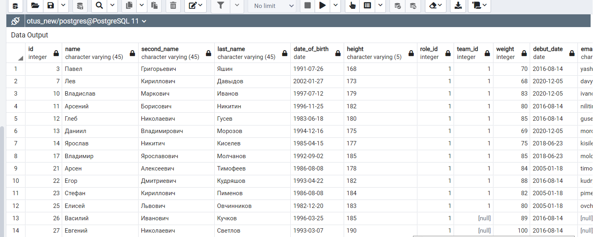
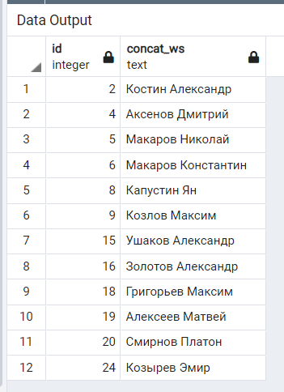

1.  **Напишите запрос по своей базе с регулярным выражением, добавьте пояснение, что вы хотите найти.**

Выберем всех игроков по имени Александр

    select * from team.players
    where name like 'Александр';

2.  **Напишите запрос по своей базе с использованием LEFT JOIN и INNER JOIN, как порядок соединений в FROM влияет на результат? Почему?**

  select 
  players.id "ID",
  concat_ws(' ', players.last_name, players.name, players.second_name) as "ФИО игрока",
  roles.name as "Позиция",
  teams.name as "Команда"
  from team.players as players
  inner join team.roles roles on players.role_id = roles.id
  inner join team.teams teams on players.team_id = teams.id
  order by players.id asc;
  

  select 
  players.id "ID",
  concat_ws(' ', players.last_name, players.name, players.second_name) as "ФИО игрока",
  roles.name as "Позиция",
  teams.name as "Команда"
  from team.players as players
  left join team.roles roles on players.role_id = roles.id
  left join team.teams teams on players.team_id = teams.id
  order by players.id asc;

* Порядок соединений влияет на порядок вывода столбцов в результате. Например, в случае вывода всех полей в запросе выше, сначала будут выведены все поля таблицы players, 
затем все поля таблицы roles и таблицы teams.
* Если поменять местами подключение таблиц roles и teams, то первыми будут выводится столбцы таблицы teams, а затем столбцы таблицы roles.
* В случае выбора определенных полей как в запросе выше, порядок подключения не будет влиять на порядок вывода столбцов.

3.  **Напишите запрос на добавление данных с выводом информации о добавленных строках.**

Добавим несколько записей в таблицу статистики тренировок

  insert into trainings.trainings
  values 
  (19, '15.02.2021', '', 2),(20, '17.02.2021', '', 1),
  (21, '19.02.2021', '', 2),(22, '22.02.2021', '', 2)
  returning *;

4.  **Напишите запрос с обновлением данные используя UPDATE FROM.**

Обновим значение поля role_id для таблицы players

  update team.players_2
  set role_id = roles.id
  from team.roles as roles
  where roles.code = 'forward';

До выполнения запроса role_id = 2

После выполнения запроса role_id = 1 для всех записей таблицы

5.  **Напишите запрос для удаления данных с оператором DELETE используя join с другой таблицей с помощью using.**

Удалим всех нападающих

  DELETE FROM team.players players
  USING team.roles roles
  WHERE roles.id = players.role_id AND roles.code = 'forward'
  RETURNING players.ID, concat_ws(' ', players.last_name, players.name);

